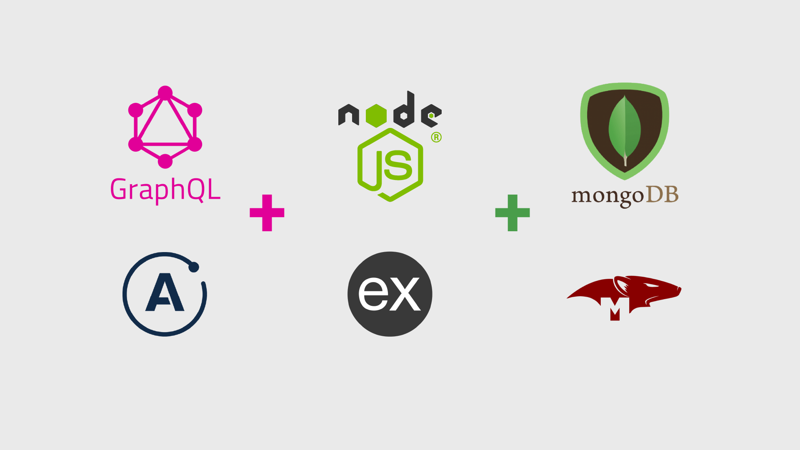
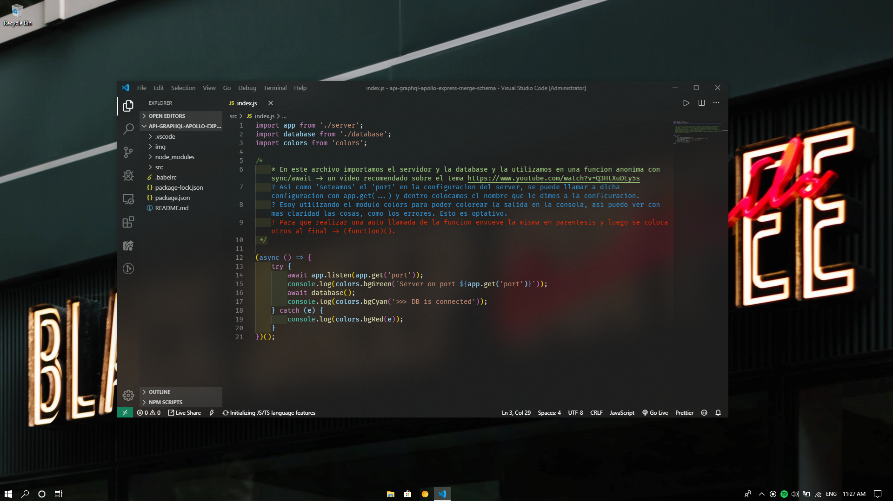

# API GraphQl Apollo Express NodeJs Mongoose -- Example

 
## API GraphQl sobre estudiantes universitarios.
 
La API se realizó como ejemplo práctico de cómo integrar GraphQl a MongoDB.
___
 
### Un poco de teoría:
 
GraphQl es un lenguaje de consulta, por lo tanto, no necesita saber dónde está alojada la información. Es decir, puede consultar varios endpoints, aunque esto signifique un JSON, una base de datos relacional o no relacional, u otra API. También puede darse el caso de que existieran varios endpoints y como se mencionó antes, *GraphQl no necesita saber dónde se aloja la información*, por lo tanto, se podría decir que se encarga de unir todo "en un solo endpoint". Como si muchas tuberías se unieran en una.
 
Otras de las ventajas de usar GraphQl, se trata en el hecho de que se sabe exactamente la información que se obtiene.
A diferencia de las REST API's que devuelven todo el conjunto de datos, por ejemplo, un objeto JSON, completo, en este caso solo recibimos los datos que indicamos de ese objeto.
 
Por lo tanto, se vuelve un proceso mucho más transparente. Además, si se realizan las Query's con mongoose con detalle, se puede optimizar mucho más.
 
---
 
### Con respecto al ejemplo creado:

El ejemplo se realizó con el fin de demostrar cómo unir todas estas tecnologías. Si bien existen maneras más eficientes de "codear" ciertas partes, opte por la manera más legible y, que, a mi entender, era más fácil de comprender.
 
Otro punto a tener en cuenta, es que el ejemplo se pensó para que el acceso a la modificación a los objetos este distinguido según el tipo de usuario. Por ejemplo, para poder modificar un estudiante, podrías hacerlo con una cuenta estudiante.
Por el contrario, para poder modificar un curso, tendrás que hacerlo con una cuenta de administrador
 
En el ejemplo encontrará comentarios con la explicación del código utilizado
 
> A medida que se actualiza el proyecto se modificará la lista
 
* [ ] Optimización de Nodejs.
* [ ] Mejorar manejo de errores en GraphQl.

---
 
### Módulos utilizados
 
Dependencies:
* "apollo-server-express"
* "colors" 
* "dotenv"
* "express"
* "graphql"
* "merge-graphql-schemas"
* "mongoose"
 
DevDependencies:
* "@babel/cli"
* "@babel/core"
* "@babel/node"
* "@babel/preset-env"
* "nodemon"
 
> **Igualmente se encuentran especificados en el package.json**
 
---
 
### Consideraciones con VSCODE
 
* Para poder ver los comentarios en diferentes colores instale 'Better Comments':
[Better Comments](https://marketplace.visualstudio.com/items?itemName=aaron-bond.better-comments "Better Comments")
* Además para poder ver bien formateado tanto el código como los comentarios, se recomienda activar en settings -> Commonly Used -> Editor: Word Wrap [on]
 
> **Ejemplo de cómo se ve:**
 

 
---
 
### Babel:
 
Como verá estamos utilizando las últimas versiones de Javascript, hasta para la parte de Nodejs, esto es más visible a la hora de recurrir a la importación de módulos. Con la versión actual de Nodejs se utiliza 'require', con una configuración de Babel y sus módulos podemos usar, por ejemplo, 'import'. Puede buscar dicha configuración en Google, y fijarse en los archivos package.json y .babelrc, este último es un archivo dedicado a la configuración de Babel.
 
---

### MongoDB:

Para poder probar el proyecto, además de inicializar el server con 'npm run dev', debe tener inicializado el servicio de MongoDB. En Windows, podría abrir otra terminal y ejecutar 'mongod'. Si utiliza otro SO deberá buscar sus respectivos comandos.

---

### dotenv:

Para proveer a nuestra REST API de un poco de seguridad, utilizaremos las variables de entorno. Esto quiere decir que guardaremos todo lo que queramos en variables solo accesibles por el sistema, y lograremos que en el código solo sean visibles esas variables y no su contenido. Por ejemplo, puede ver cuando asignamos la base de datos, vera una variable y no una ruta. Con esto ganamos una capa de seguridad ya que podrá asignar esta variable de entorno, solo accesible por el sistema, en el servidor donde se encuentre la aplicación. También se utilizan para ocultar números de puertos, key de otra API, etc.

---

> Para probar el ejemplo, ubicarse con el terminal en la carpeta del proyecto y ejecutar 'npm install'. Además debe crear su propio archivo .env, para poder colocar sus variables de entorno.
 
---
 
A medida que se vaya actualizando el proyecto voy a ir indicando comentando los cambios en el código, siéntase libre de sugerir cambios e ideas. :muscle:
 
Si logro leer todo el proyecto felicidades y gracias :smiley:, ahora tiene más que merecido una :chocolate_bar:

